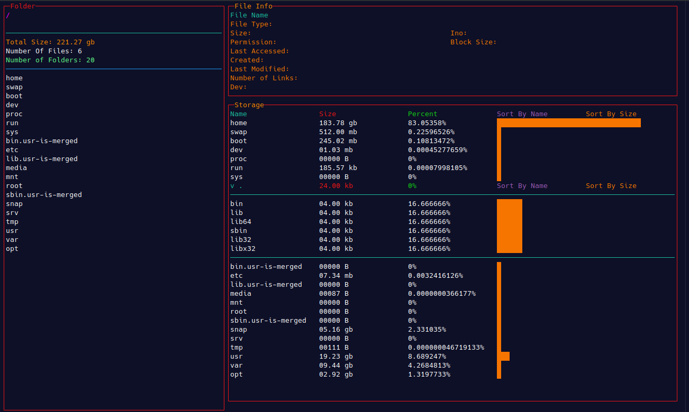

# RSTOP

A tool to view your storage with percent analysis, directly inside your terminal.
- This app provides you a feature called *Aggregator*. 
    *Aggregator* : As name suggests this aggregates all the files with same extension in the directory and show total space these files with same extension consumes. One can expand these aggregators to look at the stats of individual files also.
- Also Stats the folder or file and display various infos like modified date, created date, etc..
- Provides keyboard functionallity to move between different components of the screen.

NOTE: if running from root or from a directory whose read permission is not to with current user. then run using **sudo** 
`
    sudo ./build/rstop <Optional<folder_location>>
`

---

# Frontend

- Using [`cncurses`](https://github.com/alonot/cncurses) Component Library for `ncurses`.

# Backend

* To prevent too much contention on same memory location backend will send back data by cloning it but in packets.

* Tasks are pushed to Work Queue.
* Multiple workers start processing the tasks one by one.
* One of the worker act as a bridge between workers and frontend and keep updating the UI every one seconds.
* Readdir workers add calculateDirSize workers and aggreagate their result.
* If a new request arrives before the previous one. This worker will stop other workers with CONN_CLOSE, All the works of that Connection is closed. 
* The new task is pushed and cycle continues;