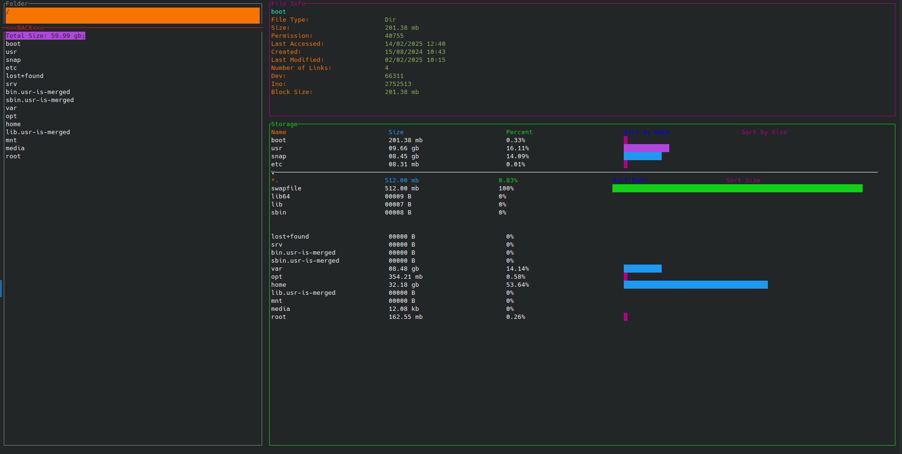

# RSTOP

A tool to view your storage with percent analysis, directly inside your terminal.
- This app provides you a feature called *Aggregator*. 
    *Aggregator* : As name suggests this aggregates all the files with same extension in the directory and show total space these files with same extension consumes. One can expand these aggregators to look at the stats of individual files also.
- Also Stats the folder or file and display various infos like modified date, created date, etc..
- Provides keyboard functionallity to move between different components of the screen.

That's all. Below is the specification about how the app was build

NOTE: if running from root or from a directory whose read permission is not to with current user. then run using **sudo** 
`
    sudo ./build/rstop <Optional<folder_location>>
`

---

# Internals

## Frontend 

* App uses *ncurses* for printing in terminal.
 But ncurses windows are independent to each other. We needed some kind of parent child relation in windows like in HTML DOM. Hence declare a trait *DisplayContent* which exposes few default functions and enforces few getters and setters. 
* This metholody helped in generalizing the refresh or content display functions.
* Any struct could be created implementing the above trait and those structs could individually re-implement any of default functions also to override their functionallity. This concept is used while handling mouse events (more about them below).

* The *DisplayContent* trait provides a *populate* function which takes in a *State*. *State* is an enum which holds different value for different structs (aka Windows). 
    -   This state is given to the *display_state* method which must be implemented by the structs. 
    -   This way  a struct (implementing *DisplayContent*), which we will call *Window* from now ), can control what need to be printed on screen using whatever value it gets in its respective State.
    -   There are various Windows declared in `./src/models/window.rs`. One example window: `TextBox` implement the *display_state* function such that it expect a string to be sent in its state and it just wprint(); that string.
    
* **Placing of Windows** 
    - *Extract_dimension* method decides where to place the windows based on values if initial_startx, and initial_starty. 
        - initial_starty : 
            * == -2  --> Auto align next chidlren from top if previous children filled all spaces to the bottom of the parent. 
            * == -1 --> place next to previous child (may overflow, if more children are given)
            * \>= 0 -> exact position with respect to *parent*
        - height: 
            * == DIMEN(-1) --> auto strech to bottom of the parent
            * == DIMEN(x>= 0)  --> exact height
            * == PERCEN(0. < x< 1.) -> x percent of the parent height

        Similarly for the width  and startx also.
        
* The above architecture separates the data (state) from actual UI (Windows). 

* All the updates to the UI occurs on main thread which loops through and do following actions in each iteration:  
    1.  Check and resolve any message from backend.
    2.  Check for keyboard or mouse events.

## Backend

* Backend is responsible for handling the data of the app and using this data updates the states of all the Windows which is then displayed on the screen by sending appropiate message to the frontend.
* Spwans a new thread and keep waiting for messages from frontend. 
* Backend works involve Reading directories, Sorting, resolving previous directory, and handling the overall content to be displayed to the terminal.
* *Readdir* : Reading a directory not only involves stating the given directory but also recursively going down the sub-directories to get thier size. 
    * It assumes that it have max of 5 threads available. As it sees a sub-directory, it spawns a new thread to calculate its size. It already 5 new threads are working then it calculates the size itself. Hence this app can spawn upto 7 threads at a time.
    *   One more important feature is that after stating 5 dirents it send signal to the frontend to display them. This way if reading a big directory , users may see content loading in chunks.

## Handling Events 
Uses default handler based approach. *DisplayContent* struct already defines few default functions like `left_click`, `right_click`, etc. These functions do nothing when called. Hence if a Window does not re-implement any of these functions then that mouse event will be neglected automatically. But If it wants any event to be handled then those it may re-implement any/all of those functions, and hence next time user tiggers that event, the respective Window's function(handler) will be called.

## Issues:
*  Does not check for terminal support on number of colors.
*  Does not scroll line by line. 
*  Spawns too many threads without considering the machine specifications.
*  delays too much if all the 5 threads are reading big directories.

